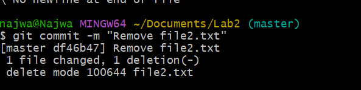

# journal
Journals for Modules 
view screenshots in file

## Lab 1
**Lessons Learned:**
- Learned how to install Git and verify the installation with `git --version`.
- Explored Git help commands (`git help init`, `git init -h`) to understand documentation options.
- Created my Git username and email with `git config`.
- Learned how to view all settings using `git config -l`.

## Lab 2
### Screenshots
  
  
  
  
  
  

**Lessons Learned:**
- Practiced creating a repository with `git init`.
- Learned the difference between untracked, staged, and committed files using `git status`.
- Staged files with `git add` and created multiple commits with meaningful messages.
- Practiced editing a file, restaging it, and committing changes.

---

## Lab 3
  
  
  
  
  
  
  
  
  
  
  
  
**Lessons Learned:**
- Used `git commit -am` to quickly stage and commit changes.
- Viewed commit history with `git log -p`, `git show`, and `git log --stat`.
- Learned how `git diff -u` behaves depending on whether changes are staged or unstaged.
- Practiced file operations (`git rm` for deleting, `git mv` for renaming).
- Created and committed a `.gitignore` file to manage excluded files.

---

This milestone taught me the **full Git workflow** from setup to file management, which I will continue to use in future projects.

---

## Lab 4 – Branch and Merge  

**What I Learned:**  
- I created a new branch, made changes, and merged it into the main branch.  
- I saw how GitHub visually displays branch merges.  
- I practiced resolving merge conflicts.  

**Screenshots:**  
-   
-   

**Reflections:**  
- **Difficulties:** Merge conflicts were confusing at first.  
- **Surprises:** The one-line log (`git log --oneline`) makes it easy to track commits.  
- **Lessons Learned:** Commit often and merge frequently to avoid large conflicts.  

**References:**  
- GitHub Docs. (n.d.). *About branches*. Retrieved from https://docs.github.com  

---

## Lab 5 – GitHub Remote Repository & Authentication  

**What I Learned:**  
- I set up a GitHub remote repo and linked it with my Lab 4 repo.  
- I used `git remote add origin` and `git push -u origin main`.  
- I generated a PAT since GitHub no longer accepts passwords for Git pushes.  

**Screenshots:**  
-   
-   

**Reflections:**  
- **Difficulties:** Remembering to copy/save the PAT the first time.  
- **Surprises:** How secure and simple PATs make Git authentication once set up.  
- **Lessons Learned:** Always verify the remote URL before pushing.  

---

## Lab 6 – Bitbucket  

**What I Learned:**  
- I set up a Bitbucket repo and pushed files to it.  
- I compared Bitbucket with GitHub:  

| Feature | GitHub | Bitbucket |  
|---------|--------|-----------|  
| Free private repos | Unlimited (with free plan) | Unlimited (with free plan) |  
| Integrations | GitHub Actions for CI/CD | Jira/Atlassian ecosystem |  

**Screenshots:**  
-   
-   

**Reflections:**  
- **Difficulties:** Getting used to Bitbucket’s different interface.  
- **Surprises:** Strong Jira integration in Bitbucket.  
- **Lessons Learned:** Different companies use different Git platforms, so knowing both is helpful.  

---

